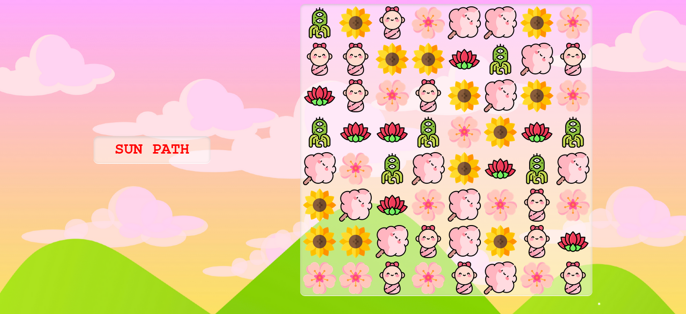

### Candy Crush 
- Inspired from [Ania Kubow](https://github.com/kubowania/candy-crush)

I created a game called Baby Rush, inspired from Ania Kubow. Thank you for making this project. 

[Live Site](https://nottohave.github.io/flower-crush/)

### About

This is a simple game. Moves are unlimited. You can refresh and play each time you run out of items to match.

To get a full board, for now you just keep on reloading.
To move item downward, you have to bring something upward.
To clone an item, move the desired item to the top left item. 

### Preview

### Bug
- Sometimes rows won't clear because unknown cause of a variable become undefined. Refresh page when this happens.

### Further development
- Making mobile and tablet friendly.
- Add animation, and perhaps sounds.
- Add sources of icon images in README to credit artists.
- Upon refresh or first load, no titles should be cleared. 
